# Heterogeneous Data Modeling:

We have a broad understanding and a solid toolkit for four of the most fundamental types of data: relational, spatio-temporal, graph-based, and textual. Unfortunately, these rarely exist in isolation like how we have been studying them. Indeed, the co-presence of multiple data types, and the need to think concurrently in multiple data models, i.e., the existence of heterogeneous data, is what most people face most of the time. It's one of the biggest challenges in Data Science, whether industry or academia.

## Data :
We are provided with dataset that is an archived data dump of an entire StackExchange community (incidentally, the one on Data Science). StackExchange is a question and answer (Q&A) forum, where users contribute "posts" (i.e., questions and answers) which they upvote. There is a tagging system to organise posts and a badge system to incentivise users.
 
The data dump contains a broad selection of the elements we have been looking at previously: the posts themselves are (marked up) temporal text, with revision histories; the votes resemble our previous MovieLens dataset; there are myriad opportunities to construct graph representations of elements of the data.The data itself is described in the following readme: https://ia800107.us.archive.org/27/items/stackexchange/readme.txt.

### Objective :
Model the data and build some features out of it.

### Key Idea :
Choose to explore how post are linked with each other and how users are linked with each other to build features.

### Main Concepts:
Graph Analysis, Text Analysis and TF-IDF cosine similarity

### Implementation : 
Text data preprocessing , Data Modeling , Data Visualization

### Packages,Software,Language used :
Language : Python  
Libraries: Pandas, numpy, matplotlib, nltk, sklearn   
Tools: Neo4j  

## Insights : 
## 1) Finding most relevant post based on Title
## 2) Recommend Post to Users
## 3) Clustering of strongly connected users
 

# Feature 1 - Finding most relevant post based on Title 
### Concepts: Adjacency List, Triple store Format, Knowledge Graph, TF-IDF 

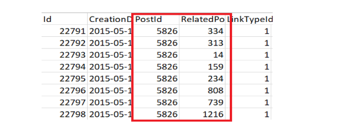

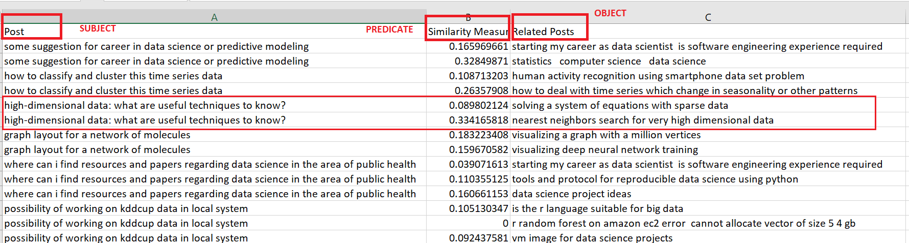

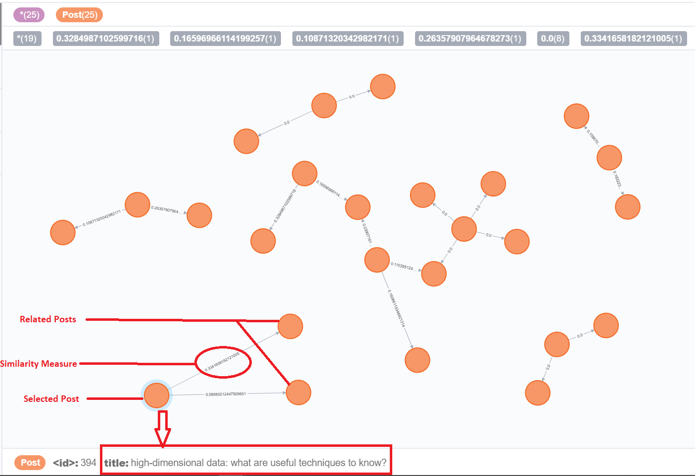

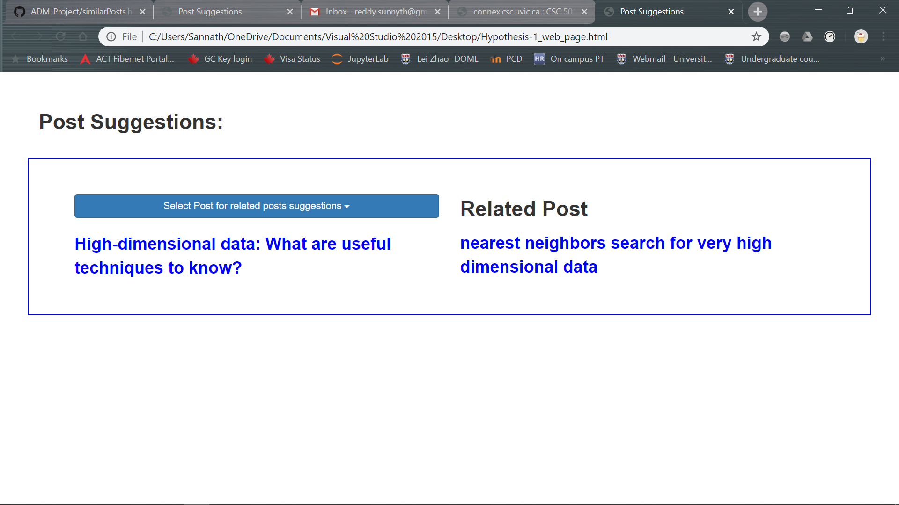

# Feature 2 - Recommend Post to user :
### Concepts: TF-IDF, Relational Data Mapping

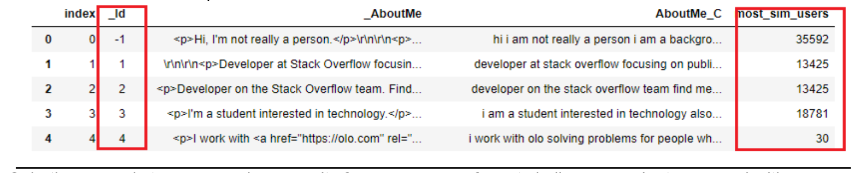

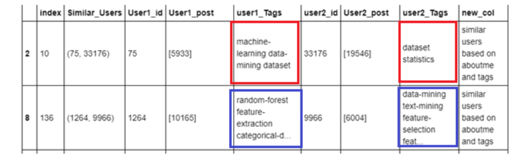

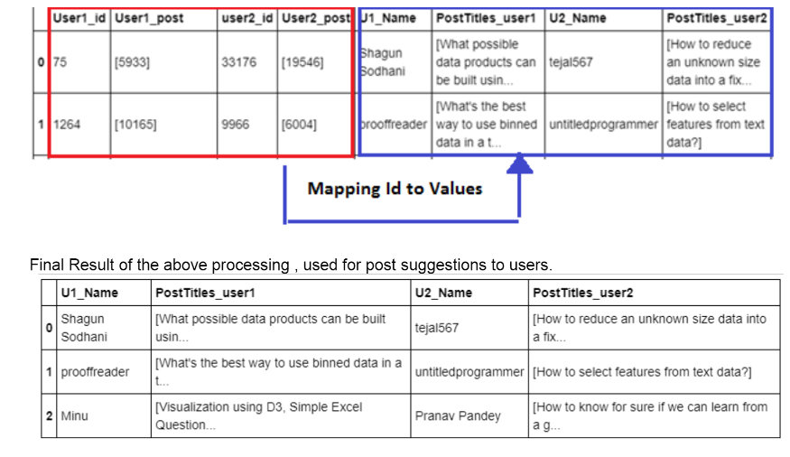

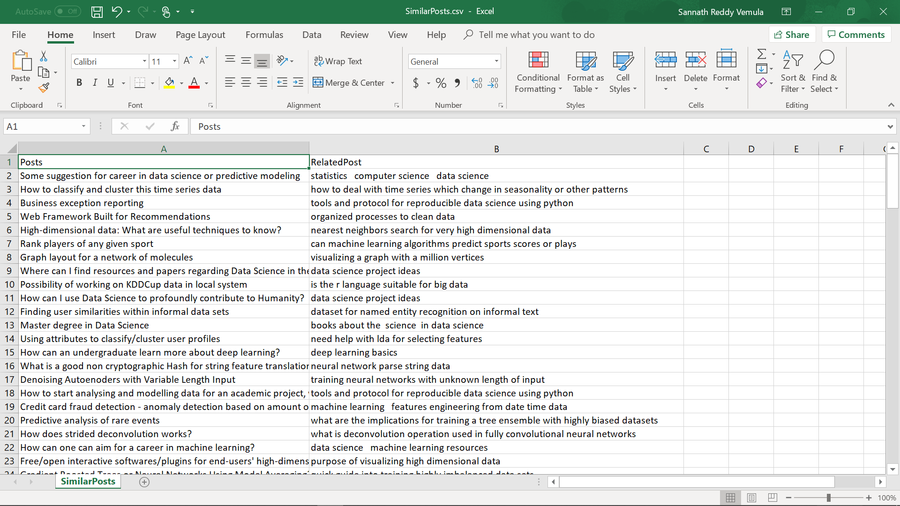

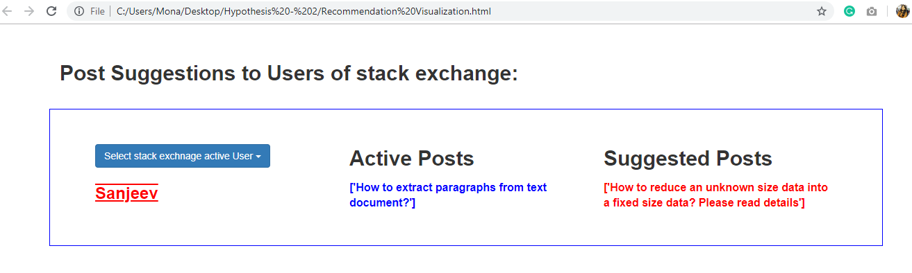

 

# Feature 3 - Clustering most connected User :
### Concepts: Consine Similarity using TF-IDF, Clustering

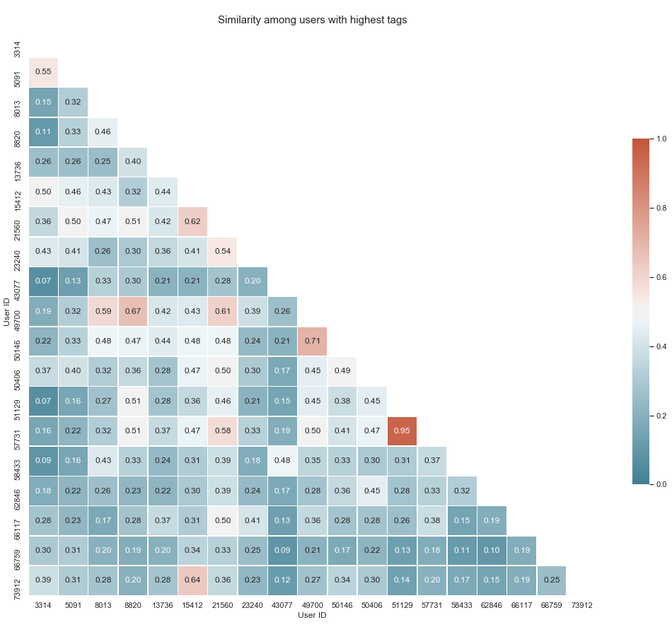

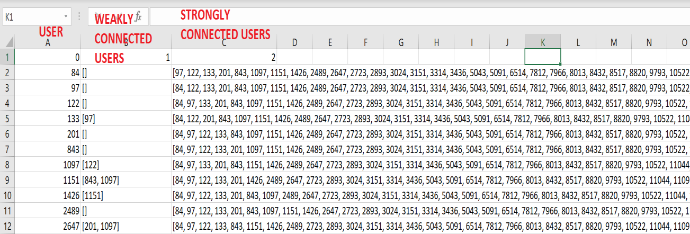

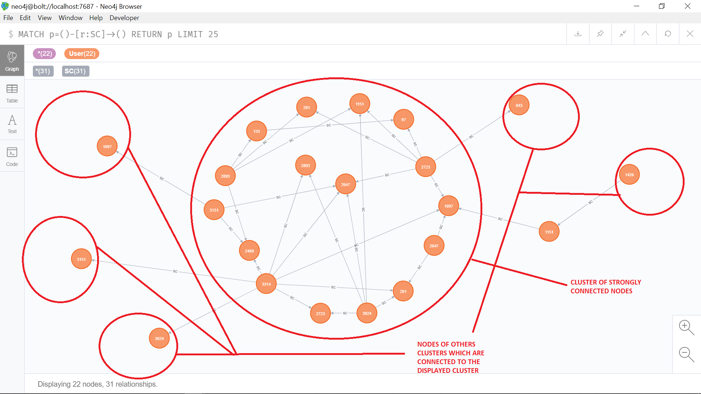

